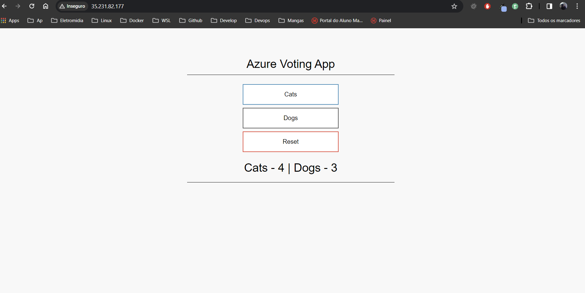

# Projeto Aula-8

Este projeto provisiona e configura uma instância VM no GCP usando Terraform, configura a VM com Ansible, e executa um conjunto de contêineres Docker usando Docker Compose.

## Tela Final



## Estrutura

- `terraform/`: Contém os arquivos Terraform para provisionar a infraestrutura no GCP.
- `ansible/`: Contém o playbook e roles do Ansible para configurar a VM.
- `docker/`: Contém o arquivo `docker-compose.yml` para gerenciar contêineres de `azure-vote`.

## Uso
Para o ususo correto é necessario ter uma conta no GCP e aplicar as credenciais padrões com:

```shell
 gcloud auth application-default login
```

Depois é só iniciar o script:
```shell
 bash init.sh
```